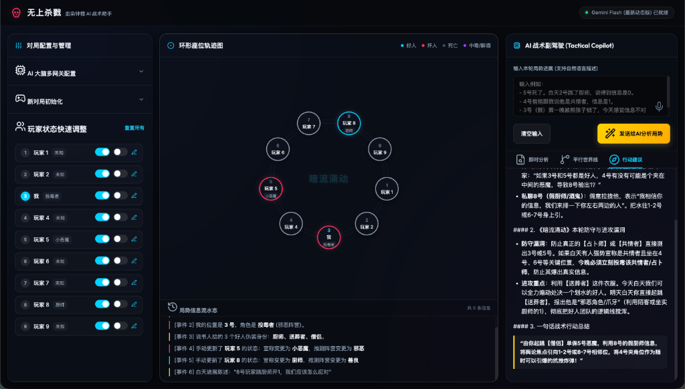

# Blood on the Clocktower AI Copilot | 《血染钟楼》玩家智能记录与逻辑辅助系统

这是一个专为《血染钟楼》游戏**玩家**设计的纯前端单页面记录与逻辑推理辅助工具。系统通过物理座位图排布、局势信息流记录以及接入前沿 AI 接口，帮助玩家在对局中清晰记录发言逻辑、理顺座位视角，并提供策略参考。

This is a pure client-side, single-page gaming visualizer and logical deduction assistant designed specifically for **players** of *Blood on the Clocktower*. By integrating structural seating charts, chronological action logs, and frontier AI reasoning models, it helps players trace verbal claims, align board perspectives, and obtain robust tactical suggestions.



---

## 🇨🇳 中文版说明 (Chinese Documentation)

### 🛠️ 控制面板功能与使用说明

系统界面由三个核心功能面板组成，以下为各面板的详细结构、功能说明及操作指引。

#### 1. 👈 左侧面板：对局配置与管理 (Control Panel)
左侧面板负责系统的初始设置、模型网关接入及玩家底牌状态的快速维护。

* **中英双语切换 (Bilingual Toggle)**：
  * 点击主页顶栏的 `English`/`简体中文` 按钮，可以在中文与英文页面之间实时进行无缝切换。系统还会自动将您的语言选择偏好记录到 `localStorage` 中。
* **AI 大脑多网关配置 (AI Gateway Config)**：
  * **功能**：用于选择 API 供应厂商（支持 Gemini、ChatGPT、Claude、DeepSeek、通义千问等 9 大主流平台），并配置对应的推理模型 ID、API Key（密钥）及接口基地址 (Base URL)。
  * **使用方法**：折叠面板内默认已填入测试用 Gemini API 密钥，开箱即用。若需使用其他厂商模型，请在下拉菜单中切换并填入对应密钥与代理地址。
* **新对局初始化 (New Game Init)**：
  * **功能**：配置本局对局的基础规则。
  * **使用方法**：设置本局游戏的总人数（支持 7 至 15 人本），并选择当前正在进行的剧本板子（支持《无上杀戮》、《暗流涌动》、《梦殒春宵》和《瓦釜雷鸣》），点击“初始化并开启新游戏”按钮生效。
* **玩家状态快速调整 (Player Status Adjustments)**：
  * **功能**：实时展示所有玩家的座位号、当前宣称底牌角色及生存状态，并提供详细状态编辑器。
  * **使用方法**：
    * **宣称与状态**：每一行展示玩家的基本配置。点击滑块可以快速切换该玩家的“存活”与“死亡”状态。
    * **详细编辑**：点击最右侧的“编辑（画笔）”图标，会弹出气泡悬浮窗（Popover Modal）。在弹窗中，您可以为该玩家选择具体的宣称角色底牌、判定阵营（善良/邪恶）、是否处于“中毒/醉酒”状态，以及撰写自定义备忘录（如“自称是守鸦人让我别碰他”）。

---

#### 2. 🗺️ 中间面板：座位图、逻辑校验器与流水志 (Visual Board & Deductive Center)
中间面板是整个游戏的物理局势沙盘与逻辑校验中心，负责图形化还原圆桌对局状态，实时校验逻辑冲突，并记录完整事件流水。

* **环形座位轨迹图 (Circular Seating Chart)**：
  * **功能**：直观展示玩家之间的物理相对位置及实时状态。
  * **视角旋转机制**：输入您自身的座位号（“我”），圆桌会自动旋转，将您的物理座位锁定在圆桌的**正下方（6点钟方向）**，其余玩家节点按顺时针依次排布。此设计能帮助玩家从自身真实第一视角观测左邻右舍。
  * **状态图示**：
    * 蓝色外圈代表善良阵营，红色外圈代表邪恶阵营（由左侧面板判定设定）。
    * 节点半透明且带暗灰边框表示该玩家已死亡。死亡节点内部会自动渲染一枚 **幽灵票存余指示灯（Dead Vote Token）**，展示死票存余情况，点击可标记使用。
    * 节点带有紫色呼吸光晕代表该玩家当前被标记为中毒或醉酒。
    * 玩家节点之间的物理邻座连线与茶艺师等技能保护线实时动态渲染。
* **大盘逻辑校验与冲突追踪器 (Deductive Validator Dashboard)**：
  * **功能**：系统核心的高级逻辑演算引擎，支持中英双语，负责实时进行全局逻辑校验，包括：
    * **角色对跳冲突 (Claim Collisions)**：自动检测并追踪多名玩家宣称同一唯一角色（如对跳共情者、对跳占卜师）的冲突，在追踪面板中以高亮红色警报显示冲突座位号。
    * **外来者数量校验 (Outsider Count)**：根据当前游戏人数读取对应的标准角色配置，与当前场上已起跳的外来者数量进行实时对比。当已起跳外来者数量溢出时自动发出警报，提示玩家关注“男爵、教父改配置”或“酒鬼、坏人穿衣服”的逻辑切入点。
    * **幽灵票存余统计 (Dead Ghost Votes)**：实时汇总所有阵亡玩家的幽灵死票存余状态，清晰展示 “存余死票 / 总死亡人数”，帮助好人团队精确规划处决轮次与死票防守线。
* **局势信息流水志 (Game Events Log)**：
  * **功能**：按时间顺序（Chronological Order）自动记录对局中发生的所有逻辑变更、玩家状态更新以及白天输入框提交的进展描述。
  * **使用方法**：此部分为系统自动维护。该日志链会直接作为 AI 提示词（Prompt）的结构化输入上下文，确保 AI 能够基于完整的历史对局脉络进行演算。当系统语言为英文时，AI 也会根据该上下文用英文做深度演算与输出。

---

#### 3. 👉 右侧面板：AI 战术副驾驶与智能同步终端 (Tactical Copilot)
右侧面板为基于大语言模型（LLM）的博弈推理输出终端，协助玩家分析逻辑漏洞。

* **输入本轮局势进展 (Daytime Input)**：
  * **功能**：支持自然语言描述本轮发生的新信息（例如：*“5号夜里死了。8号白天跳厨师，说信息是1”*）。
  * **智能语义提取与自动状态追踪同步 (NLP Smart Command Parser) [极客级功能]**：
    * 当您在右侧文本框录入白天局势进展并发送给 AI 时，系统会在后台运行一套高效的**自然语言分析提取引擎**。
    * 该引擎支持**中英双语**，能够智能识别句中的“玩家座位 + 事件行为”（如：*“5号夜里死了”* 自动将5号玩家设为死亡状态；*“8号白天跳厨师”* 自动将8号宣称更新为“厨师”；*“3号中毒了”* 自动给3号打上中毒高亮；*“1号和2号对跳共情者”* 自动更新两人的宣称并瞬间触发大盘冲突警报）。
    * 这极大简化了玩家的手动点击操作，让您只用专注记录发言，物理座位图和大盘逻辑校验器将实时与您的文字描述同步！
  * **使用方法**：在文本域中录入最新的进展陈述，点击黄色 **【发送给AI分析局势】** 按钮。系统会清空输入框，将该进展归档至流水志，并向 AI 网关发起请求。
* **推理输出选项卡 (Analysis Tabs)**：
  * 当页面切换为英文状态时，系统发送给 Gemini 等 API 的系统提示词 payload 会自动转换为高度结构化的英文，使 AI 即使面对中文的输入，也会全程以纯英文输出专业的世界线推演与战术对策。
  * **即时分析 (Instant Analysis / ANALYSIS)**：分析最新陈述中的逻辑冲突。结合圆桌收缩后的邻座变化，计算共情者、茶艺师等空间限制技能的边界是否产生异常。
  * **平行世界线 (Worldlines / WORLDLINES)**：在魔典信息真假未知的局势下，并行推演多种可能的局势走向：
    1. *正常世界线*（无异常状态下最可能在场的恶魔与穿衣服的坏人）；
    2. *涡流世界线*（若在场恶魔为涡流，所有村民信息均为假的前提下的逆向求解）；
    3. *下毒/异常世界线*（推演因爪牙技能或醉酒导致某玩家获得错误信息时的逻辑概率）。
  * **行动建议 (Action Advice / TIPS)**：结合玩家的**真实角色**与**真实阵营立场**，为玩家提供本轮的战术行动策略（如：今天最适合私聊核对信息的玩家、投票环节的诱导挂票对象、以及一句话防死/进攻指引）。

---

## 💡 实战案例演练：如何利用 AI Copilot 破解复杂局势 (Real-world Walkthrough)

README 首图展示了一场真实的 **9 人局《暗流涌动》 (Trouble Brewing)** 的第一白天博弈，完美展现了系统如何在极高阶的对局中协助邪恶阵营进行战术对抗：

### 1. 游戏背景与当前局势 (Background & Context)
* **我的真实身份**：3 号座位，**「投毒者」 (Poisoner)**。我的邪恶队友是 5 号 **「小恶魔」 (Imp)**。
* **说书人给的伪装 (Demon Bluffs)**：**「厨师」 (Chef)**、**「送葬者」 (Undertaker)**、**「共情者」 (Empath)**。
* **白天的公共发言**：
  * **7 号玩家** 跳了「厨师」，报信息为 **「1」**（表示场上存活玩家中，邪恶阵营相邻的对数有一对）。
  * **9 号玩家** 同样跳了「厨师」，报信息为 **「0」**（表示邪恶玩家互不相邻）。
  * 两人形成了直接的 **「对跳冲突 (Claim Collision)」**。

---

### 2. 系统核心模块的实时联动 (Real-time Module Synergy)
* **大盘逻辑校验与冲突追踪器**：
  * **角色对跳冲突** 面板立即抓取到 7 号和 9 号玩家的「厨师」宣称冲突，在面板中高亮红字报警显示 `厨师 (7号 & 9号) 对跳`，帮助玩家瞬间锁定逻辑风暴的中心。
  * **外来者数量校验** 与 **幽灵票统计** 自动检测到目前场上 0 位外来者起跳、9 人全员存活，展示出健康、未爆发冲突的外部大盘数据。
* **圆形物理座位轨迹图**：
  * 物理连线系统自动锁定了 3 号（我）在正下方 6 点钟的本视角位置。能够清晰看出：我（3号投毒者）与 5号（小恶魔）之间隔着 4 号，并不相邻。

---

### 3. AI Copilot 的高阶逻辑推演与战术剖析 (AI Reasoning & Suggestions)
基于魔典的绝对真实规则和收集到的发言，右侧的 **AI战术副驾驶** 在毫秒内得出了堪称大师级的博弈洞察：

#### 🔍 逻辑死结拆解 (Logical Paradox Analysis)
1. **邪恶相邻数理论上为 0**：因为 3 号（投毒者）与 5 号（小恶魔）由 4 号隔开，场上没有任何邪恶玩家相邻，因此真实的厨师信息绝对是 **「0」**。
2. **真厨师根本不在场**：由于说书人把「厨师」作为伪装 (Bluffs) 发给了邪恶阵营，因此场上这套配置里**原本就没有真厨师**（或唯一的真厨师是已经喝了“酒鬼”药水的伪镇民）。
3. **判定两人必然全假**：7 号报「1」显然是好人盲猜、或者邪恶阵营在胡乱穿衣服；9 号报「0」虽然碰巧猜中了真实的相邻数，但他依然是个“伪装者”。

#### 🎯 AI 战术行动建议 (Tactical Copilot Recommendations)
在右侧的 **【AI 战术备忘录】** 卡片中，AI 立即给出了针对邪恶阵营的毒辣行动方案：
* **【今日核心任务】**：立刻在白天与 5 号小恶魔队友沟通。由于「厨师」在我们的 bluff 池里，我们拥有完美的真伪判定视角。
* **【博弈挂票策略】**：利用好人团队的疑心，将 7 号和 9 号都打成“穿在场衣服的邪恶爪牙 / 醉酒中毒的假好人”，引导好人乱投、互相怀疑并在这两人中发起处决。这样可以顺理成章地将好人的白天处决轮次（扛推位）白白消耗在两个伪造身份的玩家身上，确保 5 号小恶魔高枕无忧，平稳带节奏进入黑夜！

---

### 🚀 快速上手指南

本系统为纯前端单页面应用（SPA），数据完全保留在本地，无任何后端依赖。

#### 1. 本地启动
* **方法 A（直接打开）**：双击项目根目录下的 `index.html` 即可在浏览器中运行。
* **方法 B（本地 Web 服务器）**：在项目根目录下通过终端启动简易 Python 服务器：
  ```bash
  python -m http.server 8000
  ```
  在浏览器访问 `http://localhost:8000`。

#### 2. 调试与对局开始
1. 刷新页面（加载时系统会自动加载上一次的 `localStorage` 缓存偏好）。
2. 在左侧面板的“新对局初始化”中选择人数与剧本。
3. 在“玩家状态快速调整”中设定您的座位号与真实身份。
4. 随着对局推进，在右侧文本域输入新发生的发言与生死变动，点击发送，等待 AI 给出战术建议。

---

### 🔒 隐私与凭证安全
* 本工具无任何后台数据库，您的所有 API Key、对局小记与历史分析结果均仅存储在您本地浏览器的 `localStorage` 中。
* 切换不同大模型时，若检测到前缀与当前厂商不匹配（如切换到 ChatGPT 时，输入框仍存有 Google 格式的 `AIzaSy` 密钥），系统会自动清空，杜绝密钥泄露风险。

---

## 🇺🇸 English Version (English Documentation)

### 🛠️ Control Panel Features & Operation

The interface consists of three core panels. Below are the functional details and operating guidelines.

#### 1. 👈 Left Panel: Setup & Management
This panel manages system initialization, AI gateway configs, and player state updates.

* **Bilingual Language Toggle**:
  * Click the `English` / `简体中文` button in the top header to seamlessly switch the entire layout and controls in real time. The system automatically persists your active language selection in `localStorage`.
* **AI Engine Configuration (AI Gateway Config)**:
  * **Feature**: Select your API provider (supports 9 mainstream gateways: Gemini, ChatGPT, Claude, DeepSeek, Qwen, etc.) and configure your model ID, API Key, and Base URL.
  * **Usage**: A Google Gemini API test key is pre-filled by default for instant, out-of-the-box reasoning. If using another provider, select it from the dropdown and insert your endpoint details.
* **Initialize New Game (New Game Init)**:
  * **Feature**: Establishes active board rules.
  * **Usage**: Set player count (supports 7 to 15 players) and select your current script (supports *Supreme Slaughter*, *Trouble Brewing*, *Sects & Violets*, and *Bad Moon Rising*), then click "Initialize & Start Game".
* **Quick Status Adjustments**:
  * **Feature**: Offers a real-time list of all seat numbers, claimed characters, and survival statuses with a detail editor.
  * **Usage**:
    * **Claims & Status**: Stretches player records vertically. Toggle the slider to instantly alternate a player's status between "Alive" and "Dead".
    * **Detail Edit**: Click the "Edit (Pencil)" icon on the far right to trigger a hover popover modal. Inside this popup, you can modify the player's claimed role, set their suspected alignment (Good/Evil/Unknown), flag them as "Drunk/Poisoned", and write custom private notes (e.g., "Claimed Ravenkeeper, asked me not to target him").

---

#### 2. 🗺️ Center Panel: Visual Board, Logic Validator & Action Logs
The sandtable visualizes the physical circular layout of players, dynamically calculates logical contradictions, and traces events chronologically.

* **Interactive Seating Circle**:
  * **Feature**: Graphic representation of players' physical seating arrangement and live markers.
  * **First-Person View Rotation**: Input your active seat number in the "My Seat Number" field, and the circular visualizer automatically rotates to lock your seat node at the **bottom-center (6 o'clock direction)**. All other seats are arranged clockwise. This visual perspective replicates your real view of the circular table.
  * **Status Diagrams**:
    * Cyan rings signify a Good alignment; crimson rings signify Evil (configured via the Popover details).
    * Semi-transparent nodes with gray borders indicate dead players. A glowing **Dead Vote Token** is automatically rendered inside dead players' nodes. Click it to mark their final ghost vote as used/active.
    * A purple neon glow ring represents that a player is currently Drunk or Poisoned.
    * Dynamic, arrowed protection lines between nodes (e.g. Tea Lady bounds) are rendered on the fly.
* **Deductive Validator Dashboard**:
  * **Feature**: A real-time, bilingual constraint-solving engine that runs underneath the seating chart to flag logical anomalies instantly:
    * **Claim Collisions**: Detects when multiple players claim the same unique role (e.g., two players claiming "Savant" or "Undertaker") and highlights them in high-contrast red warnings.
    * **Outsider Count**: Compares the standard Outsider configuration for the current player size with the claimed/suspected Outsiders. Highlights anomalies in orange if claims exceed standards, hinting at "Baron bluffing" or "evil players claiming fake roles."
    * **Dead Ghost Votes**: Automatically aggregates the active ghost votes remaining among all dead players (e.g., "Active Dead Votes: 3 / 4") in a sleek neon badge, allowing perfect planning of execution rounds.
* **Game Action & Interaction Logs (Timeline)**:
  * **Feature**: Chronologically records all logical changes, state shifts, and daytime statements submitted from the console.
  * **Usage**: Completely automated. This log is directly injected as structured context payload into the AI reasoning prompt, ensuring logically grounded worldline deductions.

---

#### 3. 👉 Right Panel: AI Tactical Copilot & Smart Sync Terminal
A specialized large language model (LLM) terminal designed to calculate contradictions, locate logical holes, and frame strategies.

* **Enter Current Turn Updates (Daytime Input)**:
  * **Feature**: Supports natural language entry of events (e.g., *"Seat 5 died tonight. Seat 8 claimed Chef with a '1' in the morning"*).
  * **NLP Smart Command Parser (Auto-Sync) [Premium Feature]**:
    * When you type daytime turn updates and send them to the AI, a background **Natural Language Processing (NLP) Parser** automatically intercepts the text.
    * Supporting both English and Chinese, it extracts player states (e.g. *"Seat 5 died"* sets Seat 5 to Dead; *"Seat 8 claimed Chef"* sets Seat 8's claim to "Chef"; *"Seat 3 is poisoned"* highlights Seat 3 in purple; *"Seat 1 and 2 claim Empath"* triggers a claim collision alert).
    * This bridges the gap between text entry and the visual board, letting you take notes naturally while the visual circle and Deductive Validator sync in real time!
  * **Usage**: Enter your statements, and click the yellow **【Send to AI for Analysis】** button. The input clears, logs the event, and queries the LLM gateway.
* **Analysis & Deduction Tabs**:
  * When the active language is English, the prompt payload transmitted to the Gemini API is automatically translated into structured English. This instructs the AI to reason and return all analyses strictly in English, despite the Chinese input labels.
  * **Instant Analysis (ANALYSIS)**: Highlights logic clashes in claims. Tracks adjacency shifts as seats shrink (e.g., Empath's new targets, Tea Lady's protective bounds) to flag anomalies.
  * **Parallel Worldlines (WORLDLINES)**: Computes logic probability distributions across at least 3 distinct worldviews:
    1. *Normal Worldline*: Assuming no Vortox or poison. Calculates demon candidates and evil bluffs.
    2. *Vortox Worldline*: If the active demon is a Vortox, all Townsfolk information must be **false**. Computes inverted logic clues (also warns about immediate Vortox wins if no execution occurs).
    3. *Poison/Drunk Worldline*: Calculates active poison pathways (No Dashii, Widow, Ceranovus, or Rascal) that lead to corrupted claims.
  * **Tactical Tips (TIPS)**: Provides actionable advice based on your **real character** and **true alignment** (e.g., optimal private chat targets to test or cover, voting strategies to push nominations, and a one-sentence warning).

---

### 🚀 Quick Start Guide

As a pure client-side single-page application (SPA), all computations and configurations run locally in your web browser.

#### 1. Running Locally
* **Method A (Direct Run)**: Double-click the `index.html` file in your file explorer to open it in any browser.
* **Method B (Local HTTP Web Server)**: Open your terminal in the repository root directory and start a lightweight Python server:
  ```bash
  python -m http.server 8000
  ```
  Then, navigate to `http://localhost:8000` in your web browser.

#### 2. Beginning a Game
1. Refresh the page (your language preferences and configurations will auto-restore from `localStorage`).
2. Set your player count and script in the collapsible "Initialize New Game" panel.
3. Configure your seat number and real character in the player grid.
4. As the game proceeds, speak or type turn events in the right terminal console, click analyze, and explore the AI's tactical suggestions!

---

### 🔒 Privacy & API Credential Security
* The application operates entirely without any remote database backend. Your API keys, game notes, and timeline histories are stored securely in your browser's private `localStorage`.
* When switching models, the system automatically purges keys that don't match the new provider (e.g., clearing `AIzaSy` keys if switching to ChatGPT), eliminating key leak risks.

---

## 📝 License
This project is open-sourced under the [MIT License](LICENSE).
